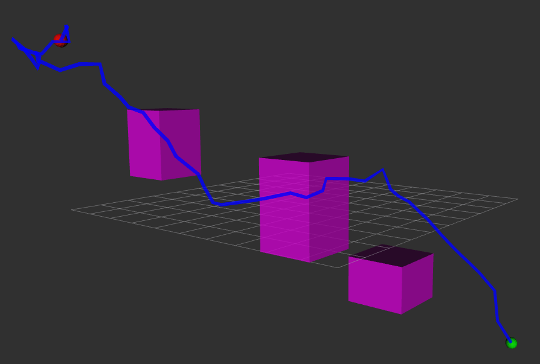

# Path-Planning-3d-RRT-Star

## Overview
This project implements the RRT* (Rapidly-exploring Random Tree Star) algorithm, an optimized version of the RRT path planning algorithm. RRT* is an asymptotically optimal sampling-based algorithm used for robotic motion planning in complex environments.

## Features
- **Optimal Path Planning**: Finds the most efficient path between start and goal points
- **Incremental Optimization**: Continuously improves the path as more samples are added
- **Obstacle Avoidance**: Navigates around complex obstacle configurations
- **Visualization**: Includes graphical representation of the search process and final path

### Parameters
You can adjust the following parameters in the code:
- `start`: Starting position (x,y)
- `goal`: Target position (x,y)
- `max_iter`: Maximum number of iterations
- `step_size`: Distance to extend the tree at each step
- `search_radius`: Radius for finding nearby nodes during rewiring
- `obstacle_list`: List of obstacles (each defined as [x,y,radius])

## Algorithm Description
1. **Initialization**: Create a tree with the start node
2. **Sampling**: Randomly sample a point in the configuration space
3. **Nearest Node**: Find the nearest node in the tree to the sampled point
4. **New Node**: Create a new node in the direction of the sampled point
5. **Collision Check**: Verify the path between nodes is obstacle-free
6. **Rewiring**: Optimize the tree by checking if nearby nodes can be reached with lower cost through the new node
7. **Path Extraction**: Once the goal is reached, extract the optimal path

